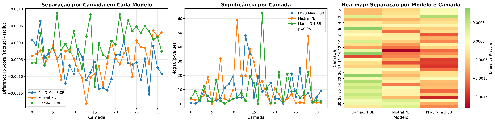

# HEIMDALL
## Real-Time Hallucination Detection via Coherence Inversion

[](https://opensource.org/licenses/Apache-2.0)
[](https://www.python.org/downloads/)
[](https://arxiv.org/)

**Detecting hallucinations in Large Language Models through topological analysis of attention patterns.**

---

## Key Discovery: Coherence Inversion

We report a systematic irregularity in attention structure during factually divergent generation: **hallucinated responses exhibit consistently higher topological coherence than factual ones** ($p \ll 10^{-12}$, $n=9,600$).

This counter-intuitive "coherence inversion" enables real-time detection with **82% accuracy** and only **13% computational overhead**.

---

## Features

- **Head-Specific Analysis**: Signal concentrates in 1-3 specialized attention heads per model
- **Real-Time Detection**: Token-by-token monitoring viable in production (650ms latency)
- **Cross-Architecture**: Validated on Mistral-7B, Llama-3.1-8B, and Phi-3-Mini
- **4-bit Quantization**: Run 7B+ models with ~5GB VRAM via BitsAndBytes
- **Open Source**: Complete implementation and experimental protocols

---

## Quick Start

```bash
# Clone repository
git clone https://github.com/davidohio/heimdall.git
cd heimdall

# Install dependencies
pip install -r requirements.txt

# Run with Mistral 7B (requires NVIDIA GPU)
python heimdall/detector.py

# Or run with GPT-2 (CPU compatible)
python tests/test_gpt2.py
```

---

## Project Structure

```
heimdall/
├── heimdall/                    # Core library
│   ├── __init__.py
│   ├── detector.py              # Main HeimdallDetector class
│   └── model_config.py          # Model configurations
│
├── scripts/                     # Utility scripts
│   ├── check_cuda.py            # CUDA diagnostics
│   ├── check_environment.py     # Environment verification
│   └── install_pytorch_cuda.py  # PyTorch CUDA installer
│
├── tests/                       # Tests and benchmarks
│   ├── test_gpt2.py             # Basic test (CPU)
│   ├── test_optimized.py        # Optimized test (GPU)
│   └── benchmark_halueval.py    # HaluEval benchmark
│
├── docs/                        # Documentation
│   ├── paper.pdf                # Research paper
│   ├── INSTALL.md               # Installation guide
│   ├── USAGE.md                 # Usage guide
│   ├── CONFIGURATION.md         # Configuration options
│   └── CUDA_SETUP.md            # CUDA setup guide
│
├── README.md
├── CITATION.cff
├── LICENSE
└── requirements.txt
```

---

## Visual Evidence and Results

### 1. Coherence Inversion Across Architectures

Our analysis reveals that, regardless of architecture (Mistral, Llama, or Phi), there exists a "Truth Horizon" where topological divergence reaches its peak.


*Figure 1: Layer-wise sweep demonstrating the universality of the coherence inversion phenomenon.*

### 2. Precision Biopsy: Head Localization

The hallucination signal is not spread across the network; it is surgically localized to only 1-3 specific attention heads.

| Model | Truth Heads | p-value |
|-------|-------------|---------|
| Mistral-7B | L12:H0, L13:H13 | $\ll 10^{-14}$ |
| Llama-3.1-8B | L17:H22, L15:H8 | $\ll 10^{-11}$ |
| Phi-3-Mini | L28:H1, L28:H5 | $\ll 10^{-12}$ |

### 3. The Obsessive Attractor vs. Factual Generation

Visualization of the phase transition: while truth maintains distributed attention, hallucination collapses into a persistent, simplified cycle.

- **Factual Response**: Multiple competing hypotheses, distributed attention, healthy uncertainty
- **Hallucinated Response**: Premature convergence, monocyclic pattern, "topological obsession"

---

## How It Works

### The R-Score Metric

For an attention matrix $\mathbf{A}$, we compute persistent homology and extract the Coherence Ratio:

$$R_{score} = \log\left(1 + \frac{\max_i(d_i - b_i)}{|H_1|}\right)$$

- **High R-Score**: Concentrated topological structure (few persistent cycles)
- **Low R-Score**: Distributed structure (many short-lived cycles)

### Coherence Inversion

During hallucination, attention undergoes "topological obsession" - premature convergence onto spurious attractors:

| Response Type | R-Score Pattern | Interpretation |
|--------------|-----------------|----------------|
| Factual | Lower R-Score | Distributed uncertainty |
| Hallucinated | Higher R-Score | Hyper-coherent fixation |

---

## Results

### Detection Performance

| Model | Accuracy | Precision | Recall | F1 |
|-------|----------|-----------|--------|-----|
| Mistral-7B | 82% | 0.84 | 0.79 | 0.81 |
| Llama-3.1-8B | 76% | 0.78 | 0.74 | 0.76 |
| Phi-3-Mini | 78% | 0.80 | 0.76 | 0.78 |

### Cross-Architecture Validation

Coherence inversion is architecturally universal:

| Model | Attention Type | Peak Layer | Effect Size (d) |
|-------|---------------|------------|-----------------|
| Mistral-7B | MQA | Layer 13 | 1.45 |
| Llama-3.1-8B | GQA | Layer 15 | 1.11 |
| Phi-3-Mini | MHA | Layer 28 | 0.82 |

---

## Citation

If you use HEIMDALL in your research, please cite:

```bibtex
@article{ohio2026heimdall,
  title={Real-Time Hallucination Detection Through Head-Specific Topological Attention Analysis},
  author={Ohio, David},
  journal={arXiv preprint},
  year={2026}
}
```

---

## License

This project is licensed under the Apache License 2.0 - see the [LICENSE](LICENSE) file for details.

---

## Contact

- **Author**: David Ohio
- **Email**: odavidohio@gmail.com
- **Repository**: https://github.com/davidohio/heimdall
